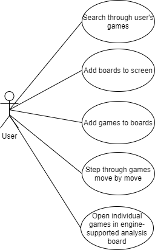

# Lichess Multi-Board Analysis Module

## Project Abstract
Lichess is the largest and most popular open-source online chess platform. Millions of games are
played every week on their site and many players use it as a place to hone their skills. Lichess has a few tools to help players improve their game – from their AI-assisted analysis board to their opening explorer, it's easy to analyze your games on their site. But I believe something is missing.
One thing Lichess does is keep a history of all your games stored in their database using encoded
strings of text called PGNs for lightweight storage. If you want to examine an individual game, you can load its PGN into an analysis board and explore where you went wrong (in chess, you're always wrong at least once). What you cannot do is explore multiple games side-by-side. This can be useful for many things. 

In chess, you typically have a repertoire of opening strategies that you focus on, so usually, up to a certain point, you have played the game the exact same way many times. What I believe would be useful is to view multiple games with the same opening patterns side-by-side. This would allow the user to explore the general shift that their opening decisions make in the flow of the game. This is what I call the Multi-Board Analysis Module. A user would be able to sort through their game history by opening, date, white/black, etc. and place multiple games on to the page at once. Users could step through them all simultaneously or one-by-one. The point is to allow easy analysis of the overall patterns your games go in to help the user identify bigger-picture issues with their strategies.

## Project Relevance
This project would involve GUI development as we'd be developing a brand new interactive page for
Lichess.com, Object-Oriented Programming will be used to structure our program, and design patterns
and API utilization will be required for this project. The project will be broken up into tasks using a trello board where the individual tasks will be assigned to group members. Lichess is coded in Scala (a Java-like programming language designed for web development). I'm new to the language myself, but considering we're all familiar with Java, I don't think it'll be too challenging.

## Conceptual Design
The module itself will be simple. It will be added to the "Tools" section of Lichess.com as its own page. On pageload, we'll make an API call to receive a payload containing all the games the user has played on Lichess (remember, these are just PGNs so it's fairly lightweight). The payload will contain all the data we'll need to filter the games out for easy selection. The user will then be presented with a list of their games and they'll be able to pick which ones will be presented on boards on the screen below the filtering options. The boards are simply populated using Lichess's open source libraries. We'll have to incorporate some responsive-design. In addition, the user will be able to step through moves of their games (a built in feature of the Lichess boards) but we'll have to make a modification to the stepping mechanism because we'll have to differentiate between stepping through multiple boards at once or single boards. 

## Background
All of Lichess's open source repos are listed here: <https://lichess.org/source>

They provide a concise and convenient guide for installing a local instance of Lichess on your machine here: <https://github.com/ornicar/lila/wiki>

Additionally, here is the URL to the API we'll be calling <https://lichess.org/api>

Lichess makes it easy for us to contribute to their libraries because they rely on developers like us to keep their platform growing. Setup is a little tricky as they kind of force you to install a VM with Linux on it to work from, but having that added step gives us more material for our resumes.  

## Required Resources
Team members should have a basic understanding of web development and OOP. Team members need access to the internet and a desire to build something that might be used by millions of people. 

I will lead gladly lead the project - I have 2 years of web dev experience in a professional environment and have developed some pet projects for Android and the web in the past. I'm excited to explore Scala and to contribute to a great organization like Lichess. 
